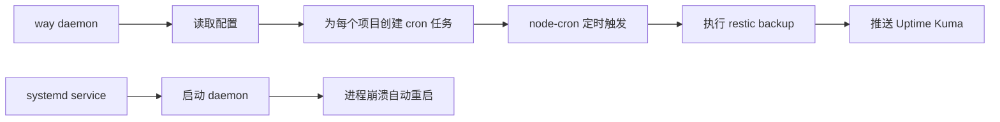

# way - 策略备份

将备份作为持续运营的项目，而非一次性任务。基于 restic 的策略封装。

推荐在所有地方使用策略备份：开发环境、个人电脑、生产服务器。

## 版本说明

- **v0.5.0+**: daemon 模式，支持项目级调度配置
- **v0.4.0**: TypeScript 版本，使用 systemd timer，凭证直接写在 YAML
- **v0.3.x**: TypeScript 版本，使用 crontab，支持 .env
- **v0.2.x**: Bash 版本

## 设计原理

### 1. 备份目的

- 意外修改或删除时，从备份提取
- 硬盘损毁、机房失联时，从备份重建
- 需要追溯历史状态时，查阅备份

### 2. 不备份可重建内容

可重建的内容不备份：docker 镜像、node_modules、缓存、构建产物等。判断标准不是"是否有价值"，而是"能否从其他来源恢复"。

### 3. 备份是项目

备份保护所有项目，其重要性是所有项目的总和。应作为最重要的项目持续运营。

### 4. 频率匹配变化

备份频率应匹配数据变化频率。高频变化时段多备份，低频时段少备份。

### 5. 可验证原则

未经验证的备份等于没有备份。定期验证备份可恢复，失败时必须有告警。

### 6. 定期清理

定期清理旧快照，防止存储膨胀。

### 7. 同步不等于备份

同步工具（如 Syncthing）会将误操作实时传播到所有节点。真正的备份必须具备版本历史和回滚能力。

### 8. 备份隔离原则

假设本机被入侵，攻击者不应能通过本机凭证定位或删除备份数据。

**v0.5.0 架构升级**：
- 使用 daemon 模式替代 systemd timer
- 支持项目级 schedule 配置（不同项目不同频率）
- 使用 node-cron 实现精确到分钟的调度
- systemd service 管理常驻进程（自动重启）

### 9. 多层冗余原则

单一备份链路存在单点故障风险。应在多个维度建立冗余：
- 时间周期：高频 + 每日 + 每周
- 存储介质：云存储 + 本地硬盘 + 异地服务器

### 10. 恢复演练原则

定期执行实际恢复演练，确认备份可解密、可读取，恢复时间在可接受范围内。

---

## 依赖

- [restic](https://restic.net/) - 备份引擎
- Node.js >= 18

## 安装

```bash
npm install -g @shellus/way
```

## 快速开始

### 1. 初始化配置

```bash
mkdir -p ~/.way
cp $(npm root -g)/@shellus/way/repositories.yaml.example ~/.way/repositories.yaml
cp $(npm root -g)/@shellus/way/rules.yaml.example ~/.way/rules.yaml
```

编辑 `~/.way/repositories.yaml` 填入实际凭证，设置权限：

```bash
chmod 600 ~/.way/repositories.yaml
```

### 2. 初始化 restic 仓库

```bash
# 本地仓库
way init

# S3 仓库（指定其他仓库）
way --remote=s3 init
```

### 3. 配置定时备份

```bash
way systemd install
way systemd status
```

### 4. 手动执行备份

```bash
way run              # 备份所有项目
way run data         # 只备份 data 项目
way snapshots        # 查看快照
```

## 命令参考

```bash
# 备份命令
way run                 # 执行所有项目备份
way run data            # 只备份 data 项目
way run data config     # 备份多个项目
way gc                  # 按 retention 策略清理旧快照
way gc --dry-run        # 模拟清理（不实际删除）

# daemon 模式（推荐）
way daemon              # 启动常驻进程，按配置定时执行

# systemd 管理
way systemd install     # 安装 systemd service（运行 daemon）
way systemd show        # 显示 systemd 配置
way systemd status      # 查看服务状态
way systemd uninstall   # 卸载服务

# 透传 restic（way 只设置环境变量）
way snapshots           # → restic snapshots
way restore abc123      # → restic restore abc123
way check               # → restic check
way stats               # → restic stats

# 指定 repository（默认用 repositories.yaml 中的 default）
way --remote=oss snapshots
```

## 生命周期



---

## 配置说明

配置文件默认存放在 `~/.way/`，安装后复制示例文件并填入实际值：

```bash
cp ~/.way/repositories.yaml.example ~/.way/repositories.yaml
cp ~/.way/rules.yaml.example ~/.way/rules.yaml
```

也可以通过 `WAY_DIR` 环境变量指定其他目录：

```bash
WAY_DIR=/path/to/config way snapshots
```

### rules.yaml

备份规则配置，参考 [`rules.yaml.example`](rules.yaml.example)：

- **defaults**: 全局默认配置（schedule、retention）
- **projects**: 备份项目配置，可覆盖默认 schedule 和 retention
- **maintenance**: 维护任务配置（prune、check）
- **global_excludes**: 全局排除规则

**项目级调度示例**：

```yaml
defaults:
  schedule: "0 */2 * * *"  # 默认每 2 小时

projects:
  data:
    paths: [/data]
    # 继承默认 schedule

  logs:
    paths: [/var/log]
    schedule: "0 3 * * *"  # 覆盖为每天凌晨 3 点

  archive:
    paths: [/archive]
    schedule: "0 2 * * 0"  # 每周日凌晨 2 点
    retention:
      keep_weekly: 8
      keep_monthly: 12
```

#### 排除规则通配符语法

restic 使用 Go 的 filepath.Match 语法：

- `*` 匹配任意字符，但**不跨越目录分隔符**
- `**` 匹配任意子目录

示例：
- `*Cache*` 只匹配当前目录下含 Cache 的文件/目录
- `**/*Cache*` 匹配任意深度子目录下含 Cache 的文件/目录

### repositories.yaml

备份目的地配置，参考 [`repositories.yaml`](repositories.yaml)。

**v0.4.0 变更**：凭证直接写明文，不再支持 `${VAR}` 环境变量语法。

```yaml
repositories:
  local:
    type: local
    path: /backup/repo
    credentials:
      password: your-password  # 直接明文
```

建议设置文件权限：`chmod 600 ~/.way/repositories.yaml`

## 配置备份

`~/.way/` 目录包含所有配置和凭证，建议整体备份到安全位置：

```bash
# 打包配置目录
tar czf way-config-$(date +%Y%m%d).tar.gz -C ~ .way

# 加密备份（推荐）
gpg -c way-config-$(date +%Y%m%d).tar.gz
```

**如果本机不可访问且遗忘了配置和凭证，所有备份数据将永久无法恢复。**

必须在本机之外保存 `~/.way/` 备份：

- 密码管理器（推荐）
- 加密云存储
- 离线存储（U 盘、纸质打印关键凭证）

关键信息：

| 项目 | 位置 |
|------|------|
| 备份规则 | `~/.way/rules.yaml` |
| 仓库配置和凭证 | `~/.way/repositories.yaml` |

## 数据恢复

way 透传所有 restic 命令，恢复数据时只需通过 way 调用 restic 的恢复相关命令。way 负责设置仓库连接和认证环境变量，无需手动配置。

### 1. 查看快照列表

```bash
way snapshots                    # 列出所有快照
way snapshots --tag=way:home     # 只看 home 项目的快照
way snapshots --tag=way:data     # 只看 data 项目的快照
```

### 2. 浏览快照内容

```bash
way ls <snapshot-id>             # 列出快照中的所有文件
way ls <snapshot-id> /root/.ssh  # 列出快照中指定目录的文件
way find --snapshot <id> <filename>  # 在快照中搜索文件
```

### 3. 恢复文件

```bash
# 恢复整个快照到指定目录
way restore <snapshot-id> --target /tmp/restore

# 只恢复特定路径
way restore <snapshot-id> --target /tmp/restore --include /root/.ssh

# 恢复单个文件到标准输出（适合快速查看）
way dump <snapshot-id> /root/.gitconfig
```

### 4. 从其他仓库恢复

```bash
way --remote=oss snapshots
way --remote=oss restore <snapshot-id> --target /tmp/restore
```

## 开发

参见 [CONTRIBUTING.md](CONTRIBUTING.md) 了解：
- 项目结构和技术栈
- 开发环境搭建
- 变更规范和测试要求
- 发布流程

内部开发参考：[CLAUDE.md](CLAUDE.md)